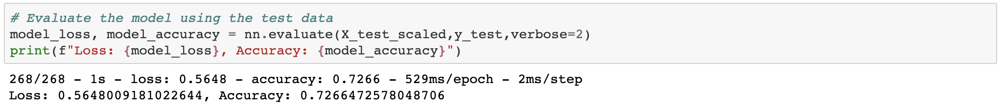
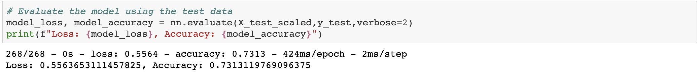

### Charity-Funding-Predictor
#### <i> Analysis to identify if an applicant funded by Alphabet Soup will be successful or not</i>

----------------------

**Description:**

Utilize Google Collab and deep learning techniques to identify success of applicants.

<b>Datasets used:</b>

* [Charity Data](Resources/charity_data.csv)

### Tools used:
----------------------

  - Python
  - Pandas
  - Google Collab
  - SKLearn
  - TensorFlow

### Analysis:
----------------------

#### Data Preprocessing
What variable(s) are considered the target(s) for your model?
* IS_SUCCESSFUL
  
What variable(s) are considered to be the features for your model?
* APPLICATION_TYPE
* AFFILIATION
* CLASSIFICATION
* USE_CASE
* ORGANIZATION
* STATUS
* INCOME_AMT
* SPECIAL_CONSIDERATIONS

What variable(s) are neither targets nor features, and should be removed from the input data?
* NAME
* EIN

#### Compiling, Training, and Evaluating the Model

How many neurons, layers, and activation functions did you select for your neural network model, and why?
* I used between 3 and 6 layers, 6,000 to 25,000 neurons, and activation functions of relu and sigmoid. These were chosen by testing what improved the model after succesive runs and also has been used for similar problems successfully.

Were you able to achieve the target model performance?
* I was not able to achieve the desired model performance.

What steps did you take to try and increase model performance?
* I altered the number of nuerons and layers used to try and increase model performance.

The results of this deep learning model did not achieve the desired result 75% accuracy. If I were to do this differently I would take a closer look at the number of neurons used in successive models.
  
###  Data Visualization:
----------------------

#### Deep Learning Model

#### Optimized Deep Learning Model
